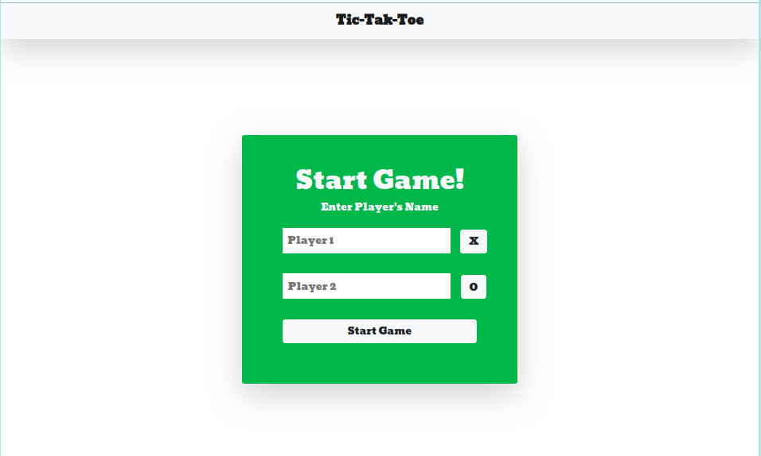
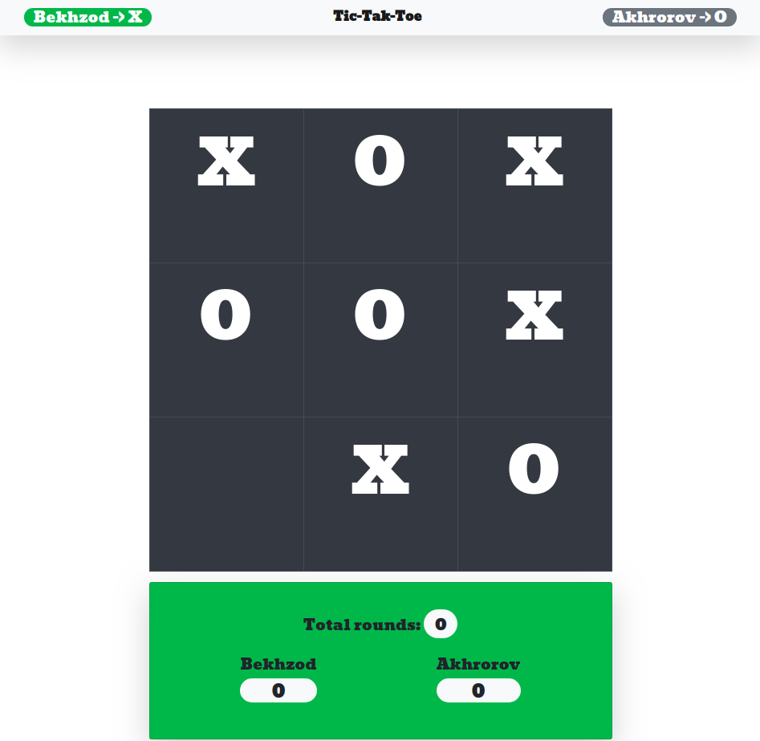

# Tic Tac Toe

Tic-tac-toe, noughts and crosses, or Xs and Os is a game for two players, X and O, who take turns marking the spaces in a 3×3 grid. The player who succeeds in placing three of their marks in a horizontal, vertical, or diagonal row is the winner. <a hreh='https://en.wikipedia.org/wiki/Tic-tac-toe'>see more...</a>

## Welcome Page

## Gamepage

## Built With

- Html
- CSS
- Bootsrap
- Javascript

## Live Demo

[Live Demo Link](https://bekhzod96.github.io/tic-tac-toe/)

## Project setup

- Clone the repository `git clone https://github.com/Bekhzod96/tic-tac-toe`
- Entry point `$./tic-tak-toe/index.html`
- You can open any browser and start playing

## Author

👤 **Bekhzod Akhrorov**

- Github:[@Bekhzod96](https://github.com/Bekhzod96)
- Twitter: [@Begzod](https://twitter.com/25d47e8987f740b)
- Linkedin:[@Bekhzod AKhrorov](https://www.linkedin.com/in/bekhzod-akhrorov/)

👤 **Hemant soni**

- Github: [@githubhandle](https://github.com/hemant-soni-vst-au4)
- Twitter: [@twitterhandle](https://twitter.com/abdelperez11)
- Linkedin: [linkedin](https://www.linkedin.com/in/hemant-soni-97427b193/)

## 🤝 Contributing

## 📝 License

This project is [MIT](https://opensource.org/licenses/MIT) licensed.
